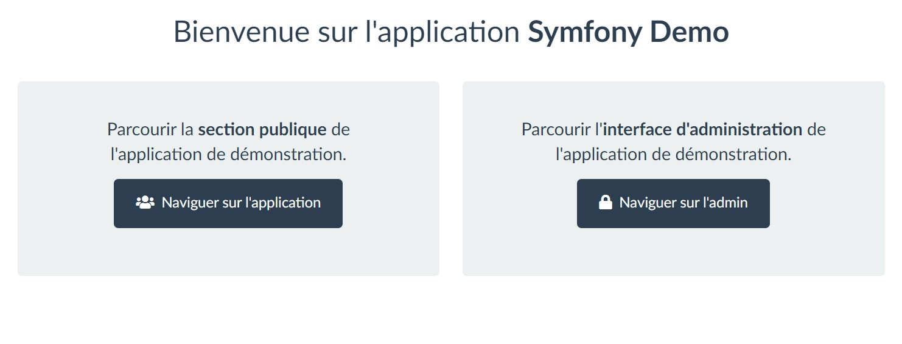

# Ansible - Deploy symfony demo on Ubuntu 20.04

This playbook will install symfony demo on an ubuntu 20.04 machine. It has been tested with docker container.

## Playbook
```
symfony-lemp_ubuntu20.04/
├── .config/
├── playbooks/
│   ├── roles/
│   └── main.yml
├── vars/
│   └── default.yml
├── ansible.cfg
├── build.sh
├── run.sh
├── Dockerfile
└── inventory
```

## Settings  `vars/default.yml`

- `http_host`: your domain name
- `www_path`: your web app root folder 
- `git_url_repository`: your git url repository to clone
- `git_branch`: your branch name
- `mysql_root_password`: your root password
- `mysql_database_url`: your credentiels database
- `db_user`: your database user
- `db_password`: your database password
- `db_host`: your database host
- `db_port`: your database port
- `db_name`: your database name
- `app_secret`: your symfony secret
- `app_env`: define dev ou prod environment
- `symfony_console_path`: your symfony console absolute path

## Secrets `vars/secrets.yml`

To display the contents of an encrypted ansible-vault file without modifying it, just use the view option

```
ansible-vault view vars/secrets.yml
```
Vault password is `secret`

## Runnning this Playbook
Quick steps after cloning the repository

### 0. Edit /etc/hosts
```
127.0.0.1       node-1
127.0.0.1       node-2
```

### 1. Get the playbook

```bash
cd ansible-playbooks/symfony-lemp_ubuntu20.04
```

### 2. Customize options
```bash
vi vars/default.yml
```

### 3. Enable the logs on node manager
```bash
touch /var/log/ansible.log 
chmod 640 /var/log/ansible.log
chown [OWNER]:[GROUP] /var/log/ansible.log
```

### 4. Launch docker container to test the playbook
```bash
./build.sh
./run.sh # Expose port 80 from container and map with host port 8080
```
Check if node target is pingable
```
ansible all -m ping
```

```
node-1 | SUCCESS => {
    "ansible_facts": {
        "discovered_interpreter_python": "/usr/bin/python3"
    },
    "changed": false,
    "ping": "pong"
}
node-2 | SUCCESS => {
    "ansible_facts": {
        "discovered_interpreter_python": "/usr/bin/python3"
    },
    "changed": false,
    "ping": "pong"
}
```

### 5. Run the Playbook
> Add ask-pass option is useful the first time, cause need to copy public key to the server
```command
ansible-playbook -v -i inventory playbooks/main.yml --ask-pass --ask-vault-pass
```

### 6. Welcome page It works

| node-1                     | node-2                    |
-----------------------------|---------------------------|
|💻 http://localhost:8080/fr | 💻 http://localhost:8081/fr|



#### 7. Run check-http task in playbook

```
ansible-playbook playbooks/main.yml --ask-vault-password --tags check-http
```

```
PLAY [Deploy Symfony Demo Application] ************************************************************************************

TASK [check-http : check that homepage returns a status 200] **************************************************************
ok: [node-2] => (item=8080)
ok: [node-1] => (item=8080)
ok: [node-2] => (item=8081)
ok: [node-1] => (item=8081)

PLAY RECAP ****************************************************************************************************************
node-1                     : ok=1    changed=0    unreachable=0    failed=0    skipped=0    rescued=0    ignored=0   
node-2                     : ok=1    changed=0    unreachable=0    failed=0    skipped=0    rescued=0    ignored=0   
```
